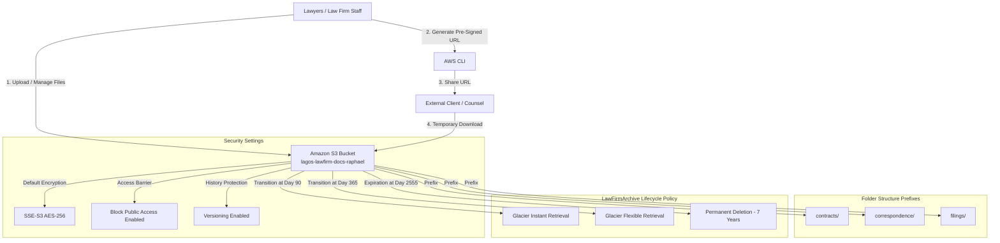
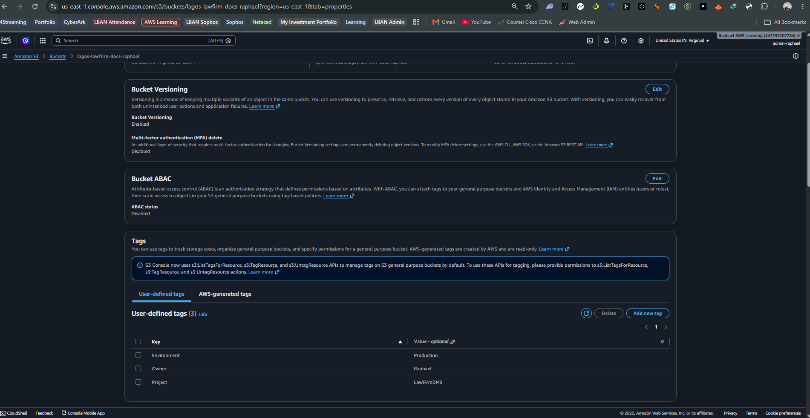
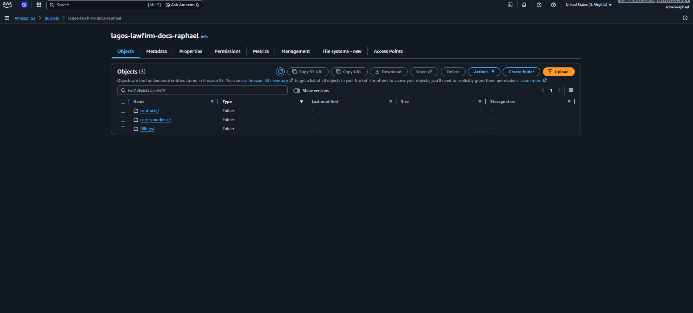
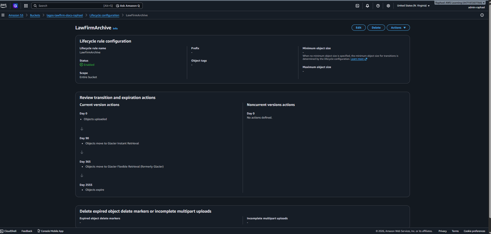
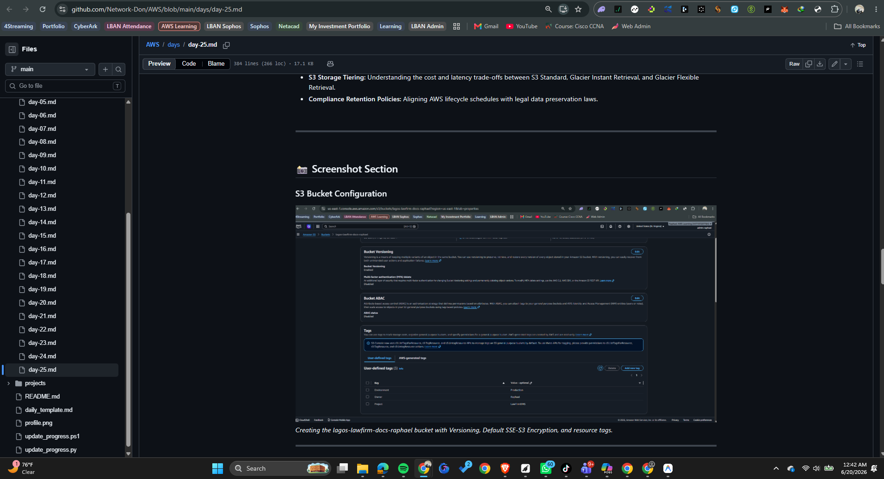

<div align="center">

# ☁️ Week 5 · Day 5 — Lagos Law Firm S3 Document Management System

*Today's lab focused on designing and implementing a secure, compliant document storage and management system for a Lagos-based law firm using Amazon S3. I configured version control, default server-side encryption (SSE-S3), custom resource tags, and a hierarchical prefix-based folder structure. Additionally, I implemented an automated S3 Lifecycle Policy for cost-effective data archiving and set up a secure, time-limited document sharing workflow using AWS CLI Pre-Signed URLs.*

</div>

---

<br>

### 📖 Lab Overview

A Lagos-based law firm handles highly confidential litigation files, client correspondence, and court filings. Protecting these sensitive records from accidental loss or unauthorized exposure is legally and operationally critical. At the same time, the firm must comply with local regulations (such as the Nigeria Data Protection Regulation - NDPR) requiring retention of certain files for up to 7 years, while keeping storage costs low.

In this lab, I built an end-to-end secure document management system (DMS) using **Amazon S3**. The architecture ensures files are encrypted by default, versions are tracked to prevent accidental deletions, data automatically moves to low-cost archive tiers over time, and lawyers can securely share time-limited files with external parties without exposing AWS credentials.

<br>

---

<br>

### 🎯 Objectives

- **Deploy Secure Storage:** Provision an S3 bucket with versioning, SSE-S3 encryption, and Block Public Access enabled.
- **Structure Prefixes:** Organize files logically under simulated folders using S3 prefixes (`contracts/`, `correspondence/`, `filings/`).
- **Implement Lifecycle Rules:** Design a cost-optimization pipeline to automatically transition files to Glacier tiers and expire them after 7 years.
- **Configure Pre-Signed Sharing:** Generate temporary, secure download URLs using the AWS CLI for secure client sharing.
- **Design a Hybrid Cloud Architecture:** Architect a data migration and file caching topology using AWS DataSync and Storage Gateway.

<br>

---

<br>

### 🛠️ Services Used

- **Amazon S3 (Simple Storage Service):** Primary cloud storage platform.
- **S3 Versioning:** Maintains history and protects files against accidental deletion.
- **S3 Lifecycle Rules:** Automates transitions between storage classes for cost optimization.
- **AWS Server-Side Encryption (SSE-S3):** Encrypts files at rest automatically using AES-256.
- **AWS CLI (Command Line Interface):** Generates secure Pre-Signed URLs for external file access.
- **AWS DataSync & AWS Storage Gateway (File Gateway):** Proposed for the hybrid storage design.

<br>

---

<br>

### 🏗️ Architecture Overview

The diagram below details the data management flow, encryption, and lifecycle transition rules for the Lagos Law Firm:



#### Bucket Configuration Details
* **Bucket Name:** `lagos-lawfirm-docs-raphael`
* **Region:** `us-east-1` (N. Virginia)
* **Versioning:** Enabled
* **Default Encryption:** SSE-S3 Enabled
* **Block Public Access:** Enabled
* **Metadata Tags:**
  * `Project` = `LawFirmDMS`
  * `Environment` = `Production`
  * `Owner` = `Raphael Omisore`

<br>

---

<br>

### ⚙️ Implementation Steps

#### 1. Created and Configured the S3 Bucket
- Navigated to the S3 Console and created a bucket named `lagos-lawfirm-docs-raphael`.
- Enabled **Bucket Versioning** to protect against accidental overwrite or deletion of case files.
- Configured **Default Encryption** using **SSE-S3** to secure all documents at rest with AWS-managed 256-bit encryption.
- Enabled **Block Public Access** to block all public access paths.
- Added metadata tags to categorize and manage the resource:
  - `Project` = `LawFirmDMS`
  - `Environment` = `Production`
  - `Owner` = `Raphael Omisore`

#### 2. Created Prefix-Based Folder Structure
- S3 is a flat object storage system and does not use physical directories. Instead, it uses **prefixes** (the text before `/` in an object key) to simulate folders.
- Created three folder prefixes and uploaded test files:
  - `contracts/sample-contract.pdf` (representative of client service agreements)
  - `correspondence/client-letter.txt` (representative of legal consult letters)
  - `filings/court-filing.pdf` (representative of court case briefs)

#### 3. Configured S3 Lifecycle Policy
- Created an S3 Lifecycle Rule named `LawFirmArchive` targetting all objects in the bucket.
- Configured transitions to cheaper storage tiers based on file age:
  - **Transition to Glacier Instant Retrieval** after **90 days** (for files accessed infrequently but needing millisecond retrieval times).
  - **Transition to Glacier Flexible Retrieval** after **365 days** (for archived files with retrieval times from minutes to hours).
  - **Expire Current Versions** after **2555 days (7 years)** to satisfy legal record retention mandates and automatically purge old records.

#### 4. Shared Files Securely using Pre-Signed URLs
- Rather than granting persistent IAM access or exposing the S3 bucket to the public internet, generated a temporary, time-limited **Pre-Signed URL** using the AWS CLI.
- Run command in terminal:
  ```bash
  aws s3 presign s3://lagos-lawfirm-docs-raphael/contracts/sample-contract.pdf --expires-in 3600
  ```
- Copied the generated link and tested it in a web browser. The PDF downloaded successfully.
- Verified that once the expiration time of 3600 seconds (1 hour) passed, the link became invalid, and the browser returned an XML `Access Denied` error page.

<br>

---

<br>

### 🛡️ Security Controls Implemented

1. **Server-Side Encryption (SSE-S3):** All legal documents are automatically encrypted using AES-256 before being written to disk, and decrypted on read. This protects the law firm against physical security breaches at AWS data centers.
2. **Object Versioning:** Every version of a document is kept. If a user deletes a file, S3 adds a `Delete Marker` instead of erasing the file. The file can be easily recovered by deleting the marker. Old versions are kept separately.
3. **Block Public Access (BPA):** Active at the bucket level, ensuring that even if a folder prefix or bucket policy is misconfigured, no data is leaked to the public internet.
4. **Time-Bound Sharing (Pre-Signed URLs):** Limits external client download windows to exactly 1 hour. This eliminates the need to maintain credentials or grant S3 bucket access to external clients.

<br>

---

<br>

### 📅 Lifecycle Policy Configuration

The `LawFirmArchive` policy manages the storage lifecycle of all case files, balancing compliance constraints and costs:

| Phase | Storage Class | Duration | Business Logic |
| :--- | :--- | :--- | :--- |
| **Active Case** | S3 Standard | Days 1–90 | Lawyers access files frequently during active legal proceedings. |
| **Recent Closed Case** | Glacier Instant Retrieval | Days 91–365 | Case is closed, but files may be referenced instantly in court. |
| **Archived Case** | Glacier Flexible Retrieval | Days 366–2555 | Legal archive for compliance. 3-5 hour retrieval is acceptable. |
| **Retention Expired** | Expired (Permanent Delete) | Day 2556+ (7 Years) | Deletes files automatically to satisfy legal limitations and stop storage costs. |

<br>

---

<br>

### 🔗 Pre-Signed URL Workflow

A Pre-Signed URL grants temporary access to an object using the permissions of the IAM user who generated it. 

#### Shared Document Workflow
```
Lawyer (AWS CLI authorized)
       │
       ▼
[Runs `aws s3 presign` Command]
       │
       ▼
(Generates signed URL with cryptographic signature & expiry parameters)
       │
       ▼
[Shares URL with Client via Email/Chat]
       │
       ▼
Client accesses URL ──(Time < 1 hour)──> Success: PDF downloads securely
       │
       ▼
Client accesses URL ──(Time > 1 hour)──> Error: Access Denied (Token Expired)
```

<br>

---

<br>

### 💰 Cost Optimization Considerations

Legal files accumulate over years. Without automated management, storage costs grow linearly. By implementing the `LawFirmArchive` lifecycle policy, the law firm saves on costs:
- **Glacier Instant Retrieval Transition:** Reduces storage costs by ~68% compared to S3 Standard, while preserving sub-second file retrieval.
- **Glacier Flexible Retrieval Transition:** Drops storage costs by ~80% compared to S3 Standard, ideal for long-term archives.
- **Automatic Expiration:** Ensures the firm does not pay to store obsolete, decade-old files, complying with storage optimization best practices.

<br>

---

<br>

### 🏢 Real-World Use Case: Lagos Law Firm

**Scenario:** The law firm specializes in complex corporate litigation and intellectual property disputes in Nigeria. They need to share draft contracts with corporate clients, maintain strict version histories of legal claims, and securely store historical court records for 7 years to comply with statutory mandates.

**Solution Value:**
- **Zero Client Overhead:** Clients do not need AWS accounts. They receive a secure pre-signed link that expires automatically, protecting draft litigation strategies.
- **Compliance Alignment:** Automatically enforces the 7-year storage retention period without manual IT audit overhead.
- **Data Protection:** Protects client confidentiality from rogue actors or accidental internal edits via S3 default encryption and object versioning.

<br>

---

<br>

### 🔑 Key Concepts Learned

- **S3 Prefixes vs. Physical Folders:** S3 is a flat structure. Using slashes in object names (e.g. `contracts/sample.pdf`) mimics directories, allowing logical sorting.
- **Pre-Signed URLs:** Utilizing the AWS CLI to generate secure, signed links containing authentication tokens that automatically expire.
- **S3 Storage Tiering:** Understanding the cost and latency trade-offs between S3 Standard, Glacier Instant Retrieval, and Glacier Flexible Retrieval.
- **Compliance Retention Policies:** Aligning AWS lifecycle schedules with legal data preservation laws.

<br>

---

<br>

## 📸 Screenshot Section

### S3 Bucket Configuration

*Creating the lagos-lawfirm-docs-raphael bucket with Versioning, Default SSE-S3 Encryption, and resource tags.*

---

### Folder Prefix Structure

*Viewing the simulated folders (contracts, correspondence, filings) in the AWS S3 Console.*

---

### Lifecycle Rules Configuration

*Configuring transitions to Glacier Instant Retrieval after 90 days, Glacier Flexible Retrieval after 365 days, and 7-year expiration.*

---

### Working Pre-Signed URL (File Download)
.png)
*Verifying that the generated Pre-Signed URL successfully fetches and downloads the sample PDF from S3.*

---

### Expired Pre-Signed URL (Access Denied)
.png)
*Testing the link after 1 hour: S3 blocks access and returns an XML Access Denied message due to expired signatures.*

---

### Published GitHub README

*Verifying the published S3 Document Management System portfolio documentation on GitHub.*

<br>

---

<br>

## ⚡ Bonus Challenge — Hybrid Storage Design Using AWS DataSync and Storage Gateway

A major roadblock for the Lagos law firm is their slow local office network and a workforce accustomed to traditional on-premises file servers. Copying large court cases directly to the cloud manually would disrupt their daily workflows.

To address this, I designed a **Hybrid Storage Architecture** using **AWS DataSync** and **AWS Storage Gateway (File Gateway)**.

### Architecture Topology
```
 [On-Premises File Server (Lagos Office)]
                  │
                  ▼ (AWS DataSync Agent)
            [AWS DataSync]
                  │ (Secure, Accelerated Transfer)
                  ▼
            [Amazon S3] (Central Cloud Document Repository)
                  ▲
                  │ (NFS/SMB Share & Cache Sync)
     [AWS Storage Gateway (File Gateway)] (Local Virtual Appliance)
                  ▲
                  │
          [Lawyers / Clients] (Mount files as local network drive: e.g., Z:\Drive)
```

### AWS DataSync: Accelerated Migration
AWS DataSync automates and accelerates moving large quantities of data between on-premises storage systems and AWS services.
- **Migration Speed:** Accelerates data transfer using a custom network protocol, optimizing bandwidth over the office internet.
- **Data Validation:** Performs cryptographic verification on all transferred files to guarantee they aren't corrupted during the move.
- **Incremental Syncs:** Only transfers files that have changed, saving bandwidth and reducing sync times during migration phases.

### AWS Storage Gateway: Local File Caching
The AWS Storage Gateway (S3 File Gateway configuration) bridges local office environments with cloud storage.
- **Familiar User Workflows:** Presents the S3 bucket to lawyers as a standard Network File System (NFS) or Server Message Block (SMB) network drive. Lawyers open, edit, and save files just as they did on their local file server.
- **Local Caching:** Maintains a local cache of recently and frequently accessed documents. If a lawyer opens an active court case file, it loads instantly from the local cache rather than downloading from the internet.
- **Automatic Uploads:** Saving files to the local mount automatically pushes them to the backend S3 bucket in the background.

### Business Benefits
- **Disaster Recovery:** If the Lagos office loses power or experiences hardware failure, all documents are securely replicated and accessible in AWS.
- **Reduced On-Premises Footprint:** Minimizes the need for expensive on-premises backup tapes and storage servers.
- **Continuous Local Performance:** Low-latency file reads for active cases via local gateway caching.
- **Zero Retraining Required:** Lawyers continue using familiar file directories (e.g. `Z:\contracts`) while the IT team leverages cloud-native compliance and archiving.

<br>

---

<br>

### 💡 Key Takeaways

- **Security by Default:** S3 provides robust encryption and blocking policies out-of-the-box. Coupling these with versioning forms a strong defense against accidental edits or ransomware.
- **Granular Life Management:** Lifecycle rules save significant storage costs over time while keeping resources organized.
- **Credential Protection:** Using Pre-Signed URLs is a superior sharing method than generating permanent access keys or modifying bucket policies.
- **Hybrid Storage Solutions:** Technologies like Storage Gateway and DataSync allow traditional enterprises to migrate to the cloud smoothly without disrupting operations.

<br>

---

<br>

### 📁 Repository Structure

```text
Week-05/
└── Day 05/
    ├── README.md
    ├── Step 1 - S3 bucket with versioning + encryption + tags enabled.png
    ├── Step 2 - Objects organised in 3 prefix folders.png
    ├── Step 3 - Lifecycle rule configured with all transitions.png
    ├── Step 4 - Pre-Signed URL working in browser (file downloads).png
    ├── Step 5 - Pre-Signed URL expired (access denied after timeout).png
    └── Step 6 - GitHub README published.png
```

<br>

---

<br>

### 🎯 Conclusion

This project successfully demonstrates how S3 can serve as a secure, automated, and cost-effective Document Management System for a compliance-focused business like a law firm. By leveraging Versioning, SSE-S3 default encryption, Lifecycle transition policies, and Pre-Signed URL sharing, the organization achieves regulatory compliance, data protection, and cost efficiency in a single cloud architecture.

<br>

---

<br>

### 📅 Progress Tracker
- [x] **Week 5 Day 5 Completed** ✅

---

<div align="center">

| [« Previous Day: S3 Cross-Region Replication (CRR)](../Day%2004/README.md) | [Next Day: N/A »](../../README.md) |
| :---: | :---: |

</div>
