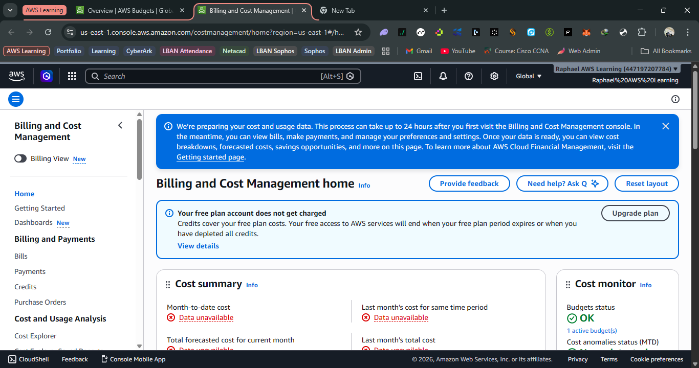
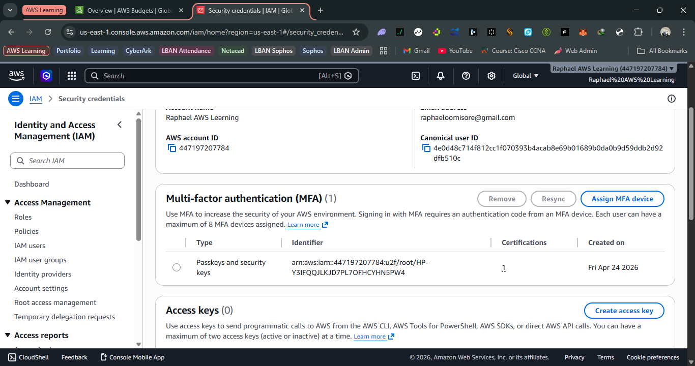
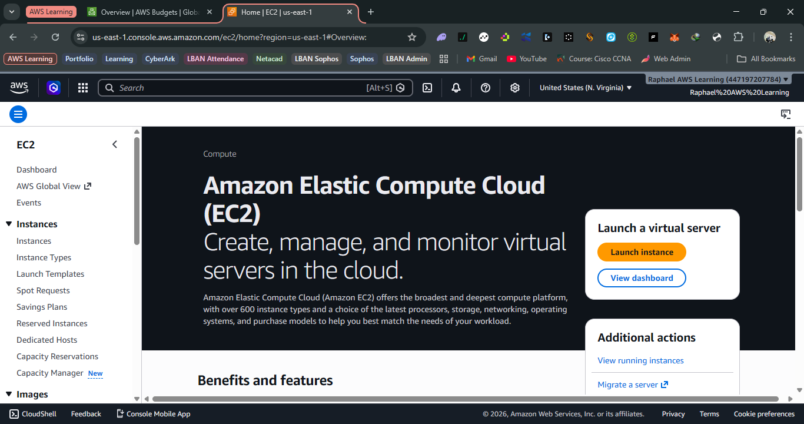
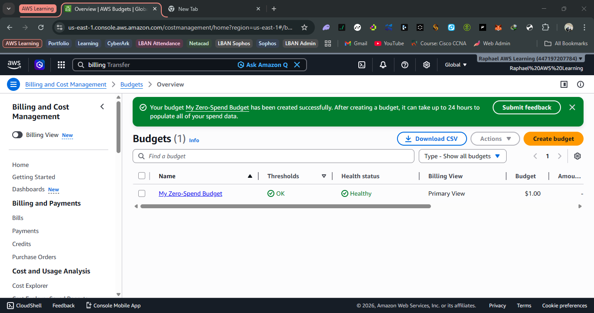
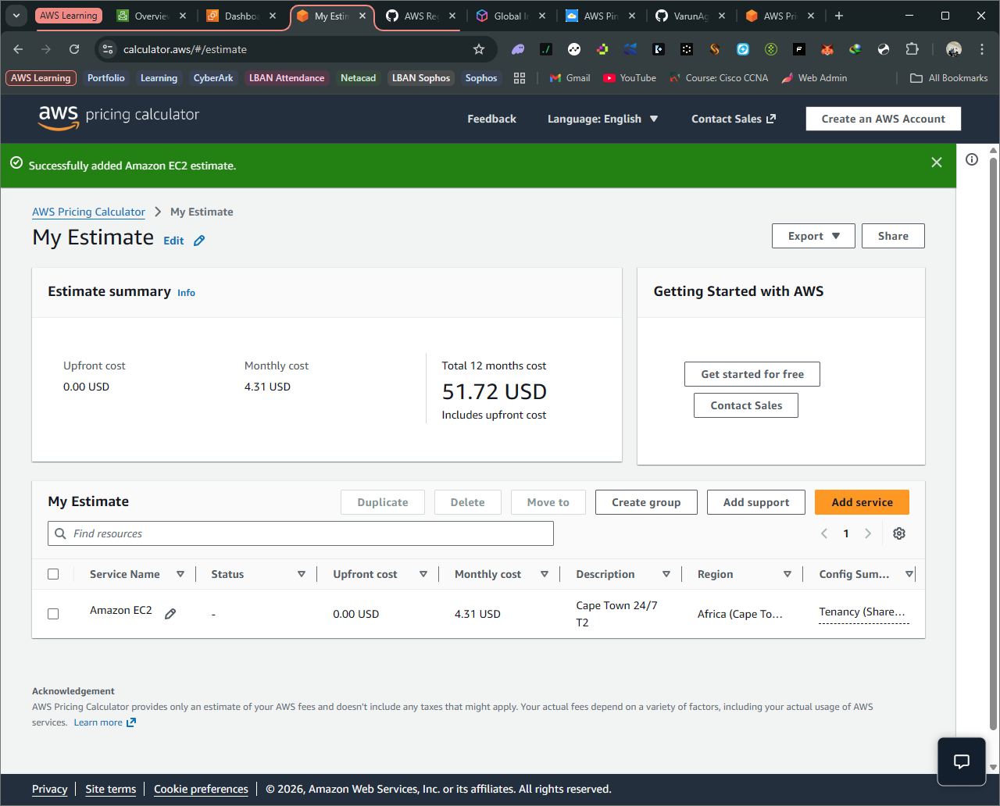

# ☁️ Day 1 – What is Cloud Computing

*Today marks the beginning of my AWS Cloud journey. In this session, I learned the core fundamentals of cloud computing and why it is fundamentally transforming how businesses build and scale applications.*

---

 

### 📌 The Core Concept

**Cloud computing** is the delivery of computing services—such as servers, storage, databases, networking, and software—over the internet ("the cloud"). 

Instead of purchasing, owning, and maintaining physical data centers and servers, users can access these vital resources **on-demand** from cloud providers like AWS.

 

---

 

### 🌍 Why Cloud Computing Matters

- **Cost-Efficiency:** Eliminates the need for massive upfront investments in expensive hardware.
- **Global Scalability:** You can expand infrastructure across the world in minutes.
- **Speed & Agility:** Provides the flexibility to test, build, and deploy rapidly.
- **Democratization:** Supports bootstrapped startups and global enterprises alike.

 

---

 

### ⚙️ The 5 Key Characteristics

I discovered that true cloud computing rests on five essential pillars:

1. **On-Demand Self-Service:** I can provision computing resources automatically, anytime, without needing human interaction from the provider.
2. **Broad Network Access:** Services are securely available over the internet and accessible from virtually any device.
3. **Resource Pooling:** Providers like AWS serve multiple customers using shared, massive-scale backend infrastructure.
4. **Rapid Elasticity:** Resources seamlessly scale up when demand spikes, and scale down just as quickly to save costs.
5. **Measured Service:** I only pay for what I actually use (the *pay-as-you-go* model).

 

---

 

### 💰 Major Benefits & 🏗️ Real-World Use Case

**Key Advantages:**
- Zero upfront capital investment.
- Massive scalability and high availability.
- Dramatically reduced maintenance overhead.
- Faster go-to-market for application deployment.

**Real-world scenario:** Imagine a brand new startup. Using AWS, they can instantly deploy a web application without buying a single physical server. If they go viral overnight, AWS effortlessly scales the resources up to meet user demand. When traffic drops, it automatically scales back down to save them money.

 

---

 

### 🧠 Reflection

Today I learned that cloud computing is much more than just "online storage." It represents a complete shift in how IT infrastructure is designed, delivered, and consumed.

The **pay-as-you-go** model paired with **instant scalability** really stood out to me. It completely removes the traditional hardware barrier to entry, allowing both solo builders and massive corporations to innovate at the exact same speed. 

While I now understand the foundational concepts, I am extremely eager to get my hands dirty in the AWS Management Console to see these mechanics in action.

 

---

 

### 🚀 Next Steps
- Dive into **AWS Global Infrastructure** *(Regions, Availability Zones, & Edge Locations)*.
- Gain hands-on console experience.
- Transition towards building real-world infrastructure projects.

 

---

## Lab Task Results

### Step 1: AWS Account Creation
Successfully created AWS Free Tier account.

---

### Step 2: MFA Setup
Enabled MFA for root account using Authenticator App.

---

### Step 3: Console Exploration
Explored EC2, S3, IAM, RDS, and Lambda services.

---

### Step 4: Billing Budget Setup
Configured Zero Spend Budget for cost control.

---

### Bonus Challenge
Estimated EC2 cost using AWS Pricing Calculator.

 

---

### 📱 X Post
> Day 1 of my AWS Cloud journey! 🚀 Just created my AWS Free Tier account,
locked it down with MFA, and explored the console. 8 weeks to SAA-C03 certification — watch
this space. #AWS #CloudComputing #LearningInPublic #TechAfrica

 

---

### 📅 Progress Tracker
- [x] **Day 1 Completed** ✅
