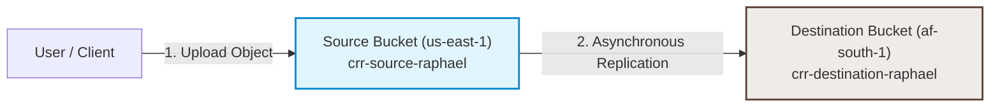

<div align="center">

# ☁️ Week 5 · Day 4 — S3 Cross-Region Replication (CRR) for Disaster Recovery

*Today's lab focused on implementing Amazon S3 Cross-Region Replication (CRR) to automatically copy objects between AWS regions for disaster recovery, business continuity, and compliance purposes. I configured a multi-region replication architecture between US East (N. Virginia) and Africa (Cape Town) using S3 Versioning, IAM replication roles, and tested near real-time synchronization.*

</div>

---

<br>

### 📖 Lab Overview

Business continuity planning requires organizations to protect their critical data against region-wide outages. If a natural disaster, major network failure, or infrastructure issue impacts a primary AWS region (like `us-east-1`), having data redundantly stored in a geographically isolated secondary region (like `af-south-1` in Cape Town) is crucial.

In this lab, I implemented **S3 Cross-Region Replication (CRR)**, which provides automatic, asynchronous, block-level copying of objects across buckets in different AWS regions. This setup utilizes S3 versioning as a foundation and uses an IAM service role to securely fetch and write data between regions.

<br>

---

<br>

### 🎯 Objectives

- **Deploy Multi-Region Storage:** Provision a source S3 bucket in the `us-east-1` (N. Virginia) region and a destination bucket in the `af-south-1` (Cape Town) region.
- **Enable S3 Versioning:** Configure version control on both buckets to meet the prerequisite for replication.
- **Configure IAM Service Roles:** Establish a secure IAM service role (`S3-CRR-Role`) permitting Amazon S3 to read from the source bucket and write to the destination.
- **Establish Replication Rule:** Design and activate a replication rule (`ReplicateToCapeTown`) targeting all objects in the source bucket.
- **Test and Verify Disaster Recovery Flow:** Upload test files to the source bucket and verify automated replication in the Cape Town region.

<br>

---

<br>

### 🛠️ Services Used

- **Amazon S3 (Simple Storage Service):** Utilized as the primary object storage service.
- **S3 Cross-Region Replication (CRR):** The engine driving automatic cross-region data transfers.
- **AWS IAM (Identity and Access Management):** Used to authorize cross-region S3 replication actions.
- **AWS Global Infrastructure:** Leveraged the geographical isolation of two distant regions (`us-east-1` and `af-south-1`).

<br>

---

<br>

### 🏗️ Architecture Overview

The diagram below outlines the flow of data upload and automatic replication:



#### Architecture Details
* **Source Bucket:** `crr-source-raphael` located in `us-east-1` (N. Virginia), versioning enabled.
* **Destination Bucket:** `crr-destination-raphael` located in `af-south-1` (Cape Town, South Africa), versioning enabled.
* **Replication Rule:** Applied to all objects, using an IAM replication role with permissions to read from the source and write to the destination.

<br>

---

<br>

### ⚙️ Implementation Steps

#### 1. Created Source and Destination Buckets
- **Source Bucket Setup:**
  - Navigated to S3 Console, created a bucket named `crr-source-raphael` in the **US East (N. Virginia) `us-east-1`** region.
  - Enabled **Bucket Versioning** (required for CRR).
- **Destination Bucket Setup:**
  - Created a second bucket named `crr-destination-raphael` in the **Africa (Cape Town) `af-south-1`** region.
  - Enabled **Bucket Versioning**.

#### 2. Created Replication IAM Role
- Created a service role named `S3-CRR-Role` that S3 can assume.
- **Lab Simplification:** Attached the `AmazonS3FullAccess` managed policy for swift permission verification.
- **Production Best Practice JSON Policies (Least-Privilege):**
  - *Trust Policy:*
    ```json
    {
      "Version": "2012-10-17",
      "Statement": [
        {
          "Effect": "Allow",
          "Principal": {
            "Service": "s3.amazonaws.com"
          },
          "Action": "sts:AssumeRole"
        }
      ]
    }
    ```
  - *Permissions Policy:*
    ```json
    {
      "Version": "2012-10-17",
      "Statement": [
        {
          "Effect": "Allow",
          "Action": [
            "s3:GetReplicationConfiguration",
            "s3:ListBucket"
          ],
          "Resource": "arn:aws:s3:::crr-source-raphael"
        },
        {
          "Effect": "Allow",
          "Action": [
            "s3:GetObjectVersionForReplication",
            "s3:GetObjectVersionAcl",
            "s3:GetObjectVersionTagging"
          ],
          "Resource": "arn:aws:s3:::crr-source-raphael/*"
        },
        {
          "Effect": "Allow",
          "Action": [
            "s3:ReplicateObject",
            "s3:ReplicateDelete",
            "s3:ReplicateTags"
          ],
          "Resource": "arn:aws:s3:::crr-destination-raphael/*"
        }
      ]
    }
    ```

#### 3. Configured Cross-Region Replication Rule
- Navigated to the source bucket `crr-source-raphael`, opened the **Management** tab, and scrolled to the **Replication rules** section.
- Clicked **Create replication rule** and configured the parameters:
  - **Rule Name:** `ReplicateToCapeTown`
  - **Status:** Enabled
  - **Source Bucket Scope:** Limit search to all objects in the bucket.
  - **Destination Bucket:** Selected `crr-destination-raphael` in `af-south-1`.
  - **IAM Role:** Selected the pre-configured `S3-CRR-Role`.
- Saved the rule. S3 automatically began monitoring the source bucket for new uploads.

#### 4. Tested and Verified Replication
- Uploaded a test file (`sample-document.txt`) to the source bucket.
- Navigated to the destination bucket `crr-destination-raphael` and refreshed the page.
- Verified that the file automatically appeared in the destination bucket in under a minute, confirming that the replication rule was operating correctly.

<br>

---

<br>

### 🛡️ Disaster Recovery & Architecture Analysis

#### Why Replicate to af-south-1 (Cape Town)?
1. **Low-Latency Client Access:** For organizations serving users on the African continent, accessing objects from `af-south-1` is significantly faster than fetching them across the Atlantic from `us-east-1`.
2. **Data Residency & Sovereignty compliance:** Frameworks like South Africa's POPIA (Protection of Personal Information Act) or the Nigeria Data Protection Regulation (NDPR) mandate that certain personal financial and health data remain on the continent. CRR helps meet these regional compliance laws.
3. **Geographical Redundancy:** N. Virginia and Cape Town are separated by over 7,000 miles. A disaster impacting the Eastern US seaboard is highly unlikely to affect infrastructure in South Africa, ensuring true disaster isolation.

#### Disaster Recovery Scenario Analysis
| Scenario | Source Bucket (us-east-1) | Destination Bucket (af-south-1) | Impact / Recovery |
| :--- | :---: | :---: | :--- |
| **Normal Operations** | Active (Read/Write) | Active (Replicated Copy) | Normal operations; clients write to source, reads can be split. |
| **Region Outage in us-east-1** | ❌ Offline | ✅ Online & Accessible | Failover DNS to Cape Town; clients read historical replicated data, maintaining uptime. |

#### Backup vs. Replication: Clarifying the Difference
- **Replication (CRR):** Operates continuously and asynchronously. It is designed to minimize your **Recovery Point Objective (RPO)** in the event of an infrastructure outage. However, because replication copies all object changes (including deletions or data corruption) immediately to the destination, it is *not* a backup solution.
- **Backups:** Point-in-time snapshots of data that are locked and version-controlled. If a ransomware attack or application bug corrupts your files in the source bucket, replication will replicate the corrupted files. Backups allow you to restore the system to a clean, historical state.

<br>

---

<br>

### ⚡ Bonus Challenge — S3 Replication Time Control (RTC)

#### What is S3 Replication Time Control?
Standard S3 Cross-Region Replication is asynchronous; AWS provides no guarantee on how long it takes for a file to synchronize (though it typically happens in seconds or minutes). For enterprise workloads with strict compliance SLA requirements, AWS offers **S3 Replication Time Control (RTC)**.

S3 RTC guarantees:
- **99.99% of objects** are replicated within **15 minutes**.
- **SLA backing:** If AWS fails to meet the 15-minute window, credits are issued.
- **Granular Monitoring:** Real-time replication metrics and alerts via Amazon CloudWatch (monitoring replication latency, remaining bytes, and replication status).

```
┌──────────────────────────────────────────────────────────────────┐
│             S3 Replication Time Control (RTC) SLA                │
│                                                                  │
│  [ Upload File ] ──(SLA-Backed 15 min limit)──> [ File Replicated ] │
│   ▲                                               ▲              │
│   └─────────────── CloudWatch Metrics Monitoring ──┘              │
└──────────────────────────────────────────────────────────────────┘
```

#### Cost Implications of S3 RTC
Enabling S3 RTC incurs additional costs compared to standard CRR:
1. **Replication Charge:** S3 RTC has a dedicated replication fee per GB of data transferred.
2. **Data Transfer Out Charges:** Standard inter-region data transfer fees still apply.
3. **CloudWatch Metrics Fees:** Charge per replication rule for tracking real-time status.

#### Evaluation for a Nigerian Fintech Platform
A Nigerian fintech platform processing customer transactions and storing regulatory audit logs must evaluate whether S3 RTC is worth the investment:

##### Worth the Cost:
* **Transaction Ledger Storage:** Financial databases and ledgers require an exact copy in a secondary region. An RPO of over 15 minutes could mean losing critical transaction logs if a failover occurs.
* **Compliance Logs:** Regulatory authorities (such as the Central Bank of Nigeria - CBN) may mandate that audit trails be mirrored offsite within a strict time frame.
* **Active-Passive Database Failovers:** If the database backup logs are replicated to a passive region, guaranteeing replication times ensures the standby DB can spin up with minimal data loss.

##### May Not Be Worth the Cost:
* **Development/Testing Buckets:** No SLAs are required for non-production environments.
* **Internal Performance Metrics/Logs:** Non-critical application logs can use standard CRR.
* **Document Archives:** Customer invoice PDFs or identity verification image uploads can tolerate longer replication delays.

##### Recommendation
A fintech firm should implement S3 RTC specifically for **transaction ledgers, account balances, and security logs** where an RPO of <= 15 minutes is legally or operationally required. For general files (user profiles, statement archives, and code assets), standard CRR should be used to minimize data transfer costs.

<br>

---

<br>

### ⚠️ Challenges & Solutions

- **Pre-requisite Versioning Errors:**
  - *Challenge:* Attempting to configure replication rules resulted in console errors if versioning was disabled on either the source or destination bucket.
  - *Solution:* Ensured that S3 Versioning was explicitly enabled on *both* buckets before setting up the rule.
- **African Region Permissions (af-south-1):**
  - *Challenge:* The `af-south-1` region is disabled by default in some AWS accounts.
  - *Solution:* Navigated to the AWS Account console, scrolled to regional settings, enabled the Cape Town region, and waited for activation before creating the destination bucket.
- **Handling Historic Objects:**
  - *Challenge:* Realized that setting up a CRR rule only replicates *new* objects uploaded after the rule creation. It does not replicate files that already exist in the source bucket.
  - *Solution:* For pre-existing objects in a production migration, S3 Batch Operations must be initiated to replicate existing data.

<br>

---

<br>

### 🔑 Key Learnings

- **Versioning is Mandatory:** Versioning is the foundation of S3 replication. It allows S3 to track object changes and ensure that modifications, deletes, and writes are properly ordered and synchronized.
- **Asynchronous Nature:** S3 CRR operates asynchronously. Under normal circumstances, synchronization occurs in under a minute, but S3 RTC is required to guarantee a 15-minute window.
- **Cross-Account Replication:** While this lab utilized a single account, CRR can replicate across different AWS accounts, providing a security boundary against compromise.

<br>

---

<br>

### 🧠 Skills Demonstrated

- **Multi-Region Cloud Architecture:** Designing infrastructure spanning N. Virginia and Cape Town.
- **Amazon S3 Enterprise Administration:** Mastering CRR rules, version control, and multi-region replication.
- **Identity & Access Management (IAM):** Formulating service roles and trust permissions for S3.
- **Disaster Recovery Planning:** Evaluating RPO, RTO, and active-passive backup flows.
- **Financial Compliance Analysis:** Cost modeling S3 RTC for fintech environments.

<br>

---

<br>

### 🎯 Conclusion

This lab demonstrated how S3 Cross-Region Replication acts as a crucial pillar of modern disaster recovery design. By automating asynchronous transfers from `us-east-1` to `af-south-1`, organizations can protect their files from region-wide disruptions, satisfy sovereignty compliance laws, and deliver high-performance access to global users.

<br>

---

<br>

## 📸 Screenshot Section

### Source Bucket Replication Rule Configuration

*Configuring S3 Versioning and setting up the ReplicateToCapeTown replication rule on the source bucket.*

---

### Destination Bucket in Cape Town

*Confirming that the destination bucket has been successfully provisioned in the af-south-1 region.*

---

### File Uploaded to Source Bucket

*Uploading the test document sample-document.txt into the active source bucket in us-east-1.*

---

### Automated Replication Confirmed

*Verifying that the uploaded file has automatically replicated to the destination bucket in af-south-1.*

---

### Bonus Challenge: Replication Time Control Configuration

*Enabling the SLA-backed 15-minute Replication Time Control (RTC) parameter on the S3 replication rule.*

<br>

---

<br>

### 📅 Progress Tracker
- [x] **Week 5 Day 4 Completed** ✅

---

<div align="center">

| [« Previous Day: S3 Security & Access Control](./day-23.md) | [Next Day: N/A »](#) |

</div>
